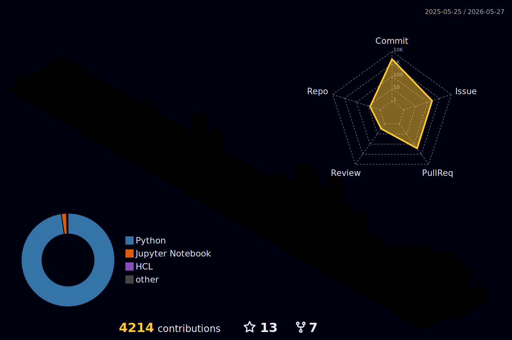

<!-- Animated wave banner -->

  

<!-- Typing animation -->

  

  
  

---

### 🧑‍💻 About Me

- 💬 Ask me about **Databricks, Data Engineering, BI, Cloud, Azure, Modern Data Platforms**
- 👨🏼‍💻 Working as a **Principal Consultant** at [ALTYCA](https://altyca.ch/)
- 📖 Blogging on my [Techie-Site](https://stefanko.ch)
- 📝 Also writing on [Medium](https://medium.com/@stefanko-ch)
- ⚡ Fun fact: I turn coffee into data pipelines

---

### 🛠️ Tech Stack

  
  
  
  
  

  
  
  
  

---

### 📊 GitHub Stats

  
  

  

---

### 📌 Featured Repositories

  
  

---

### 🏆 Trophies

  

---

### 🧊 3D Contribution Calendar

  

---

### 📈 Contribution Activity

  

  

---

### 🎛️ GitHub Metrics

  

  
📦 More Metrics Plugins

  

    
    
    
  

---

### 🏙️ GitHub Skyline

> Explore my contributions as a 3D city on **[skyline.github.com/stefanko-ch](https://skyline.github.com/stefanko-ch/2025)** 🌆

---

### 📝 Latest Blog Posts — [stefanko.ch](https://stefanko.ch)

<!-- BLOG-POST-LIST:START -->- [Nexus Stack: Your Data. Your Rules. Your Flow](https://www.stefanko.ch/p/nexus-stack/) Jan 22, 2026- [Secure Hetzner Docker Deployment via Cloudflare Zero Trust Tunnel](https://www.stefanko.ch/p/zero-entry-docker/) Jan 06, 2026- [Building a Live Data Simulator for Data Engineering Practice](https://www.stefanko.ch/p/adventureworks-simulator/) Dec 09, 2025- [From SharePoint to Databricks – and Back: Seamless Bidirectional Integration](https://www.stefanko.ch/p/databricks-sharepoint-integration/) May 28, 2025- [From Snapshots to CDC: How to load Snapshot-Data with Databricks Delta Live Tables](https://www.stefanko.ch/p/delta-live-table-full-snapshot-source/) Mar 16, 2025<!-- BLOG-POST-LIST:END -->

➡️ More on [stefanko.ch](https://stefanko.ch)

---

### ✍️ Latest Medium Stories

<!-- MEDIUM-POST-LIST:START -->- [Nexus Stack: Your Data. Your Rules. Your Flow](https://stefanko-ch.medium.com/nexus-stack-your-data-your-rules-your-flow-46b29abc062d?source=rss-f99ea8b243c2------2) Jan 22, 2026- [Secure Hetzner Docker Deployment via Cloudflare Zero Trust Tunnel](https://stefanko-ch.medium.com/secure-hetzner-docker-deployment-via-cloudflare-zero-trust-tunnel-8f716c4631ce?source=rss-f99ea8b243c2------2) Jan 06, 2026- [Building a Live Data Simulator for Data Engineering Practice](https://stefanko-ch.medium.com/building-a-live-data-simulator-for-data-engineering-practice-10d924720492?source=rss-f99ea8b243c2------2) Dec 09, 2025- [From SharePoint to Databricks — and Back: Seamless Bidirectional Integration](https://stefanko-ch.medium.com/from-sharepoint-to-databricks-and-back-seamless-bidirectional-integration-307373efadfc?source=rss-f99ea8b243c2------2) May 28, 2025- [From Snapshots to CDC: How to load Snapshot-Data with Databricks Delta Live Tables](https://stefanko-ch.medium.com/from-snapshots-to-cdc-how-to-load-snapshot-data-with-databricks-delta-live-tables-2e32df4fd591?source=rss-f99ea8b243c2------2) Mar 16, 2025<!-- MEDIUM-POST-LIST:END -->

➡️ More on [medium.com/@stefanko-ch](https://medium.com/@stefanko-ch)

---

### 🌐 Connect with Me

  
  
  

---

### ☕ Support

  

<!-- Animated wave footer -->

  

